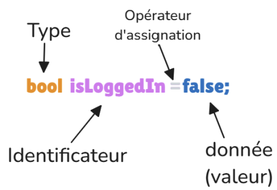

# Variables en dans le langage dart

Il est fortement recommandé de respecter la convention concernant les identificateurs :
ils doivent être écrits en **camel case**.

En début de nom, une convention veut qu’un underscore signifie souvent que la variable est privée.

Il existe aussi les versions screaming de certaines casses,
c’est-à-dire écrites entièrement en majuscules
(comme quand on hurle en silence lors d’une conversation sur un chat → to scream) :

SCREAMING_SNAKE_CASE : utilisée en Dart pour les constantes globales.


# Déclaration d'une variable (explicite)
```dart
String pseudo = "everest32";

//déclaration explicite d'une variable de type primitif
```


## Déclarations avec inférence de type

Dart est un langage à typage statique avec inférence de type, ce qui signifie qu’il peut deviner automatiquement le type d’une variable à partir de sa valeur initiale, sans que vous ayez besoin de l’indiquer.

On peut aussi opter pour le typage implicite, en utilisant par exemple le mot-clé var : Dart déduit alors automatiquement le type de la variable à partir de la valeur qui lui est affectée :

```dart
var pseudo = "everest32"; // Typage implicite
```

## const et final
Par ailleurs, deux mots-clés permettent de créer des variables dont la valeur ne peut pas être modifiée : const et final. Le mot-clé *const* définit une constante connue à la compilation, dont la valeur est fixée immédiatement et ne peut jamais être changée. Le mot-clé final, lui, désigne une constante à l’exécution : la valeur peut être affectée plus tard, mais une seule fois. Dans les deux cas, il est possible – et parfois souhaitable - d’ajouter un typage explicite pour clarifier l’intention du code.

```dart
const pseudo = "everest32"; // Constante à la compilation typée implicitement
final pseudo = "everest32"; // Constante à l’exécution typée implicitement
const String pseudo = "everest32"; // Constante à la compilation typée explicitement
final String pseudo = "everest32"; // Constante à l’exécution typée explicitemnt
```
Le fait que le typage soit déduit au moment de l’exécution avec le mot-clé *final* permet de déclarer une variable *sans l’initialiser immédiatement*. La valeur pourra être affectée plus tard dans le code, mais une seule fois. **Une fois affectée, la variable devient immuable.**


```dart
final userName ;
// Plus tard dans le code
userName = "Francis"; // Attention, à partir de là, plus de modification possible !
```

## late type
On peut aussi reporter l’initialisation d’une variable avec le mot-clé *late* qui permet d’indiquer au compilateur que l’on **promet d’initialiser une variable plus tard, avant sa première utilisation**, mais pas forcément dès sa déclaration. On l’utilise principalement avec des variables *non-nullables*, lorsque l’on ne peut pas ou ne veut pas encore leur assigner une valeur au moment de leur déclaration.


````dart
late String userName;

void main() {
  userName = "Francis";
  print(userName);
}
````
Ici, userName est une variable de type String qui ne peut pas être nulle, mais elle est déclarée sans valeur initiale. Dart accepte cela grâce au mot-clé late, qui marque l’engagement de l’initialiser avant toute utilisation. Si ce contrat n’est pas respecté, Dart déclenchera une LateInitializationError au moment de l’exécution.


Enfin, **late peut aussi être combiné avec final** pour créer une constante initialisable une seule fois, mais plus tard :

````dart
late final String config;

void setup() {
  config = "Version A"; // A partir de là, plus de modification possible !
}
````
Cela peut être très pratique dans certaines situations comme l’injection de dépendances, 
ou la lecture d’une valeur depuis un fichier ou une API qui ne sont pas disponibles à la compilation.


