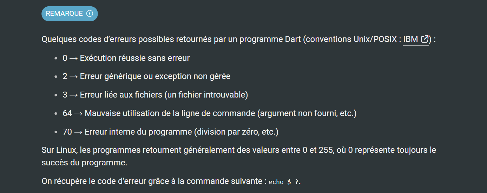

# Dart:io


Enfin, bien qu'en Dart main() ne puisse pas retourner
une valeur explicite (elle doit toujours être de type void),
il est possible d'utiliser un exit() pour terminer l'exécution du programme
avec un code de sortie spécifique. 
Cette fonction **exit()** doit être importer du package **dart:io**,
sinon on a l’erreur suivante : « Error: Method not found: 'exit' ».


```bash
import 'dart:io';

void main() {
  print("Fin du programme");
  exit(0); // Quitte le programme avec un code de succès
}
```

